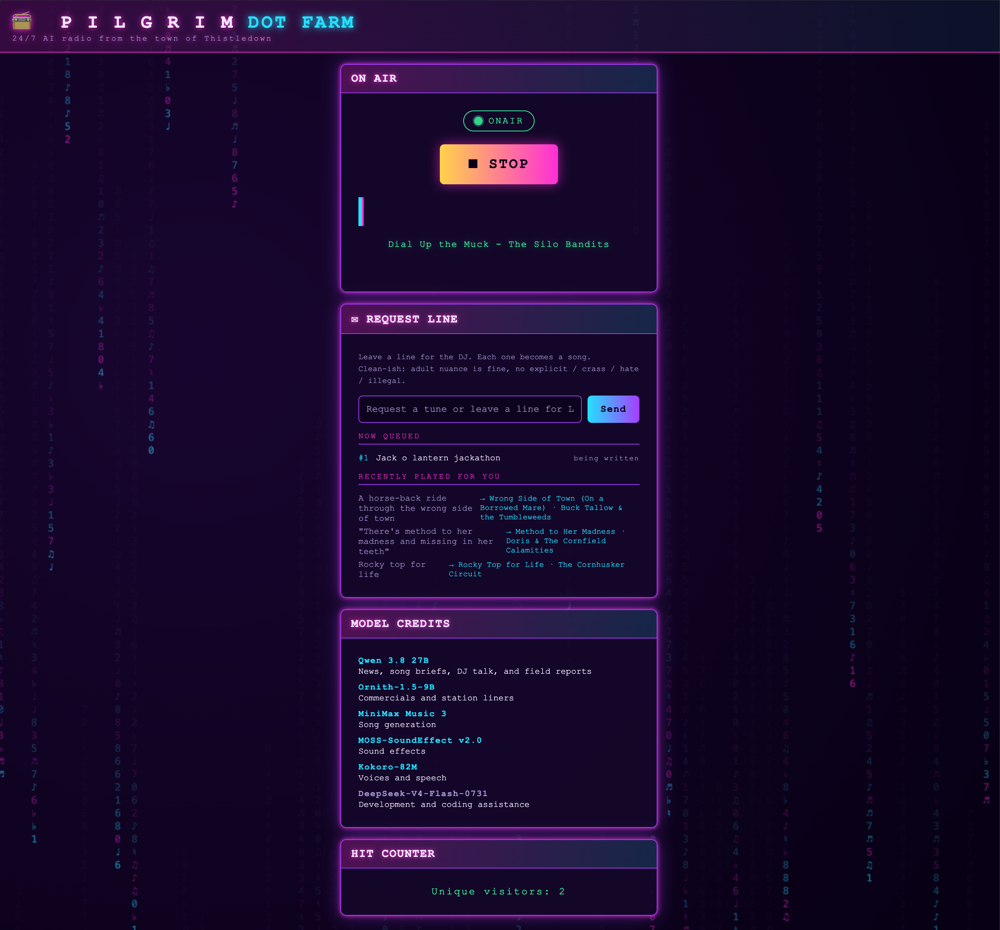

# Pilgrim Dot Farm Radio

A fictional small-town station that makes its own music and keeps playing. MiniMax
Music 3 generates songs; LLMs write the news, ads, and DJ copy; Kokoro gives the
station its voices. The browser plays finished, checked audio from the library,
so listeners never wait for a song to render.

## Get started

The Makefile uses Python 3.14. Install `ffmpeg` and `ffprobe`, then set the
backend addresses and models in [pilgrim/config.yaml](pilgrim/config.yaml).
Their observed request formats are recorded in [docs/backends.md](docs/backends.md).
Put `LITELLM_TOKEN=...` in a git-ignored `.env` file at the repo root.

```sh
make venv       # install Python dependencies
make seed       # fill a new library using the real backends
make run        # serve the station at http://localhost:5000
make tui        # operator DJ console (Textual; needs PILGRIM_DJ_TOKEN for /api/admin/dj/*)
```

Seeding generates real audio and can take a while. The server also refills
inventory in the background. The station keeps its media in `pilgrim/library/`
and its inventory and airplay history in `pilgrim/station.db`.

## Check the station

```sh
make lint      # ruff and mypy; install the pyproject.toml dev extras first
make test      # unit tests with fake backends
make sim       # 24-hour simulated run with assertions
make e2e       # Playwright browser tests with fake audio
make smoke     # explicit real-backend probe
```

For lint, install the dev tools with `.venv/bin/pip install -e '.[dev]'`.
Browser tests also need the Playwright package from `pilgrim/tests/e2e/`
and Chrome. Unit tests and simulation do not call real backends.

## How it fits together

- Producers generate songs and speech ahead of time, check the audio, and add
  ready items to the library.
- The scheduler chooses from ready inventory and keeps a committed program
  ahead of the listener.
- The browser schedules decoded clips through the Web Audio API for continuous
  playback.

All application code, prompts, the station bible, and tests live under
`pilgrim/`. [RADIO.md](RADIO.md) is the station specification;
[AGENTS.md](AGENTS.md) has the working rules.

## Secrets

Keep credentials in environment variables or the git-ignored `.env` file.
`LITELLM_TOKEN` authenticates LLM, moderation, and news requests. The
[DJ console plan](TUI.md) calls for a separate `PILGRIM_DJ_TOKEN`; its API is
not wired into the server yet. Never use the LiteLLM token for DJ controls.
Service URLs belong in `pilgrim/config.yaml`.


