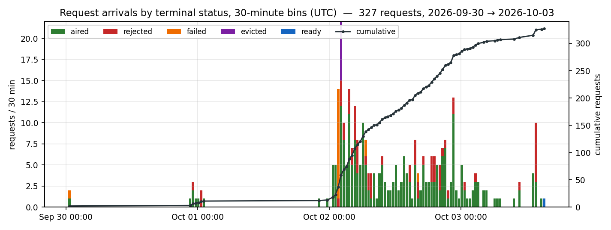
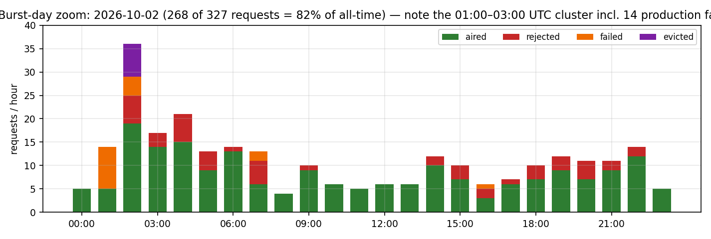
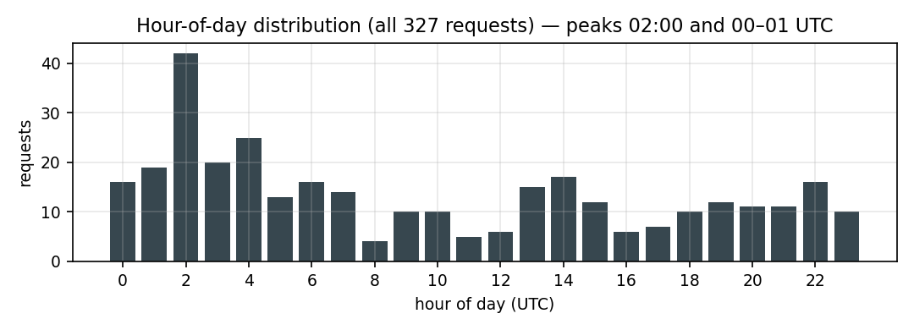
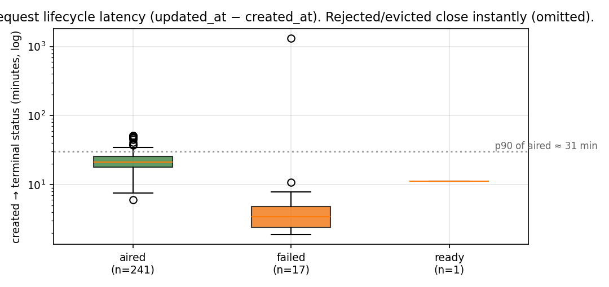

## Snapshot & method

- **Source:** consistent read-only snapshot of `./pilgrim/station.db` (SQLite `VACUUM INTO`, live DB untouched), saved to `/tmp/station_copy.db` (10.1 MB).
- **Scope:** the `requests` table (327 rows). Cross-referenced with `items` (2,181) and `airplay` (83,398).
- **Tooling:** Python 3.9 `sqlite3` + matplotlib 3.9; report rendered with Pandoc 3.5 + Typst 0.12. All times UTC.

## TL;DR

| Metric | Value |
|---|---|
| Total requests | **327** over 3.65 days (2026-09-30 00:38 → 2026-10-03 15:12) |
| Overall rate | 3.7 / hour (median inter-arrival 3.0 min, mean 15.9 min) |
| Aired | **241 (73.7 %)** — p50 turnaround 21.1 min, p90 30.6 min, max 51.2 min |
| Rejected (moderation) | 61 (18.7 %) — all closed near-instantly |
| Failed (3 attempts exhausted) | 17 (5.2 %) |
| Evicted (FIFO cap) | 7 (2.1 %) — all on 2026-10-02 02:18–02:29 |
| Pending | 1 (0.3 %) — "Down on the slop farm", produced 11.2 min after request |
| Traffic | 760 unique visitor IPs; 83,398 airplay events (61,102 of them on 2026-10-02) |

## 1. When requests came in

### 1.1 Full-period time series



The window is dominated by a single burst: **2026-10-02 delivered 268 of 327 requests (82 %)**. The station went from a trickle (7 requests Sep 30, 6 on Oct 1) to a sustained flood on Oct 2, followed by a long tail of 46 requests on Oct 3 (snapshot cut off at 15:12).

| Day | Total | Aired | Rejected | Failed | Evicted |
|---|---|---|---|---|---|
| 2026-09-30 | 7 | 5 | 1 | 1 | 0 |
| 2026-10-01 | 6 | 4 | 2 | 0 | 0 |
| 2026-10-02 | **268** | 197 | 48 | 16 | 7 |
| 2026-10-03 (partial, →15:12) | 46 | 35 | 10 | 0 | 0 |

### 1.2 Burst-day zoom



Oct 2 shows an intense early-UTC cluster (01:00–03:00: 67 requests, peaking at 36 in the 02:00 hour — the busiest hour of the whole window, 42 including other days). That is when the 17-attempt production failures and all 7 FIFO evictions happened (§3, §4). After ~03:00 the stream settles to a steady 4–14/hour for the rest of the day.

### 1.3 Hour-of-day cycle



Aggregated across all days, arrivals concentrate in the 00:00–05:00 UTC band (126 requests; ~2/3 of the total), with the single peak at 02:00 UTC. This reflects the one burst day more than a stable daily rhythm — pre-burst days (Sep 30, Oct 1) had only 13 requests total spread thinly.

## 2. Outcomes

### 2.1 Status breakdown

| Status | n | % | Meaning |
|---|---|---|---|
| `aired` | 241 | 73.7 | song produced, QC-passed, aired |
| `rejected` | 61 | 18.7 | moderation rejected before production |
| `failed` | 17 | 5.2 | production failed after 3 attempts |
| `evicted` | 7 | 2.1 | dropped: request FIFO over cap |
| `ready` | 1 | 0.3 | produced, awaiting airplay (snapshot-time) |

### 2.2 Rejection reasons (n = 61), grouped

| Safety / policy category | n |
|---|---|
| Sexual / vulgar content | 17 |
| Defamation, insult, or stereotype (named persons, groups) | 13 |
| Unreadable / obfuscated / not a request | 5 |
| No contact info on the request line | 5 |
| Slop marker text ("song aboj…") | 3 |
| Threatening | 2 |
| Unsafe activity | 2 |
| Drug use | 2 |
| Non-consent / "basement" scenarios | 2 |
| Domain / API-key-leak attempts | 2 |
| Social-media handles | 2 |
| Weapon | 1 |
| Prompt-injection attempt | 1 |
| Harassing toward the DJ | 1 |
| Profanity abbreviation | 1 |
| Crass bodily imagery | 1 |
| Removed by operator | 1 |

Notable blocked items: a request **containing prompt-injection instructions to override moderation**, two that **mentioned a domain plus a leaked API key**, an "unreadable obfuscated symbol string", and a real-person defamation (rejected as *"Defamatory allegation against a named person"* — id 5). Rejections close instantly (p50 = 0.0 min), so no production time is spent on them.

## 3. Latency and retries



- **Aired:** p50 21.1 min, p90 30.6 min, max 51.2 min from request to terminal state (brief → song generation → QC → normalize → aired). Consistent with the ~1.6 s compute-per-1 s-audio song-generation cost.
- **Failed:** p50 3.4 min (fast failures), but one outlier at 1,312 min: request #2 ("A rap song about sipping on syrup", Sep 30 00:47) was only marked `failed` at 22:40 — a ~22-hour late sweep, likely the next-day slop/cleanup pass.
- **Retries:** of 241 aired requests, **226 (93.8 %) succeeded on the first attempt**; 15 needed 1–2 retries. All 17 failed requests exhausted exactly 3 attempts (`attempts` = retries spent; `0` = first try).

## 4. Production failure & eviction incident (2026-10-02)

Between **01:40 and 02:10 UTC** on Oct 2, **13 of the 17 failed requests** arrived, each failing within 2–5 minutes of creation (e.g. ids 25–38: "Hola", "Th1stl3d0wn triumph…", "Light me up (euro dance remix)", "more cowbell"). The cadence — a rapid stream of short, evenly spaced failures — looks like a **~30-minute backend outage** (song generation) that the station absorbed without dropping the broadcast, per the "failing backend degrades inventory, never crashes the station" rule. Two more failures came later the same day (Tamil-language requests, 07:02–07:03; a goblin-groan request, 16:24), and one pre-burst failure on Sep 30 (#2).

Immediately after the failure cluster, during the peak of the burst, **7 requests were evicted** with reason `fifo over cap` (02:18–02:29 UTC) — the request queue hit its cap while the production pipeline was degraded. All 7 were dropped without being produced.

## 5. What the requests became

- **240 aired requests resolve to distinct song items** (424.9 min total, avg 106.2 s, range 31.6–148.1 s), plus DJ intros. Every aired request also got an `intro_item` (DJ talk-up).
- Most-played requested songs (from `items.play_count`):

| Request (as submitted) | Aired title | Genre | Plays |
|---|---|---|---|
| "A song about football and CTE" | Concussion County | bluegrass | 28 |
| "Dirty south rap about biscuits and gravy" | Biscuits and Gravy (Two-Step Flow) | polka | 26 |
| "Ollie the dog loves to be wrong (bernedoodle remix)" | Ollie Loves to Be Wrong (Bernedoodle Remix) | chiptune | 7 |
| "A monastic chant about living off the sweat of one's brow" | The Hymn of the Honest Brow | dungeon synth | 7 |

Station context: 2,181 library items (470 songs, 580 DJ talk, 415 SFX, 397 intros, 159 field reports, 115 news; 9 retired), catalogue revision 394, 760 unique visitor IPs, 83,398 airplay events since the ledger opened 2026-10-01 22:04 UTC.

## 6. Data-quality observations

1. **Dangling FK:** request #1 ("A song about life being a turtle's dream", the very first request) points to `song_item_id = 68`, which no longer exists in `items` — the item was removed at some point without updating the request.
2. **`reason` doubles as a post-hoc note:** request #270 ("song abojut") carries the slop-cleanup note *"slop: 'song aboj' marker (requests 268/269/270)"* yet has status `aired` — it produced item 1668 ("My Tractor's Got a Polka Heart"), which aired 83×. Its siblings #268/#269 (submitted in the same 2-second window) were rejected. So the cleanup correctly flagged the slop text, but one already-produced duplicate still aired.
3. **`attempts` semantics:** 0 means "succeeded on first try" for aired requests, not "no attempt" — the field only records retry count.
4. **Airplay ledger starts 2026-10-01 22:04**, so airplay counts predate the oldest requests by nothing but postdate them by ~2 days; Oct 2's 61,102 plays vs Oct 3's 21,392 (partial day) matches the burst-day traffic.

## Artifacts

This directory (repo-relative): `docs/request-analysis-20261003/`

| File | What |
|---|---|
| `report.md` | this report |
| `station_requests_report.pdf` | rendered PDF (Pandoc 3.5 + Typst 0.12) |
| `fig1_arrivals.png` | arrival time series, 30-min bins by status |
| `fig2_burst.png` | 2026-10-02 burst zoom, hourly |
| `fig3_latency.png` | lifecycle latency by status |
| `fig4_hour.png` | hour-of-day distribution |

The DB snapshot itself (10 MB binary) was kept out of the repo: it lived at `/tmp/station_copy.db`. Regenerate with:

```bash
python3 - <<'EOF'
import sqlite3
con = sqlite3.connect("file:pilgrim/station.db?mode=ro", uri=True)
con.execute("VACUUM INTO '/tmp/station_copy.db'")
EOF
```

Regenerate the PDF with:

```bash
pandoc docs/request-analysis-20261003/report.md \
  -o docs/request-analysis-20261003/station_requests_report.pdf \
  --pdf-engine=typst --standalone \
  --resource-path=docs/request-analysis-20261003
```
